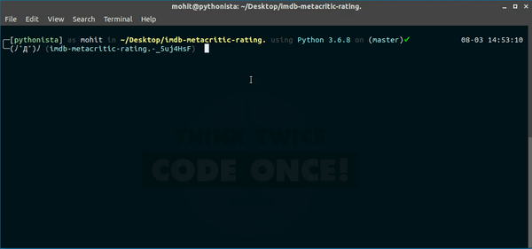

# IMDb and Metacritic rating of Movies

Analyzing the distributions of IMDB and Metacritic movie ratings to see if we find anything interesting.
To do this, first scrape data for over 2000 movies from imdb website.


## Running the Code:

Open your bash terminal -
``` bash
git clone https://github.com/ifat-mohit/analyze-movie-rating.git
cd analize-movie-rating/
pip3 install -r requirements.txt
cd src/
python3 script.py
```



The script will make 72 request to grab arround 3600 movies data in 8-15 sec time interval.

Then there will be a file "named movie_rating.csv". This will be our dataset.

Then open Ipyhton notebook in Jupyter Notebook.
